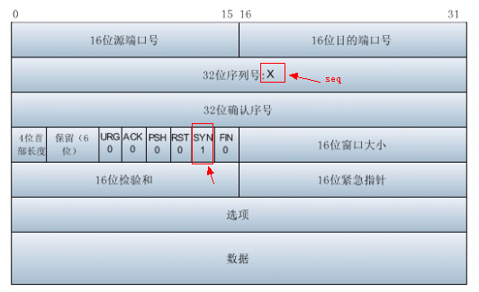
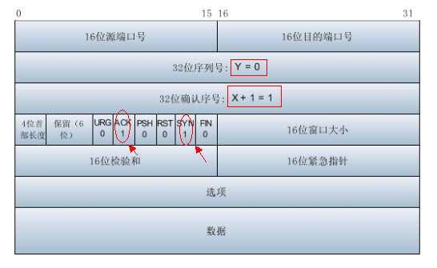
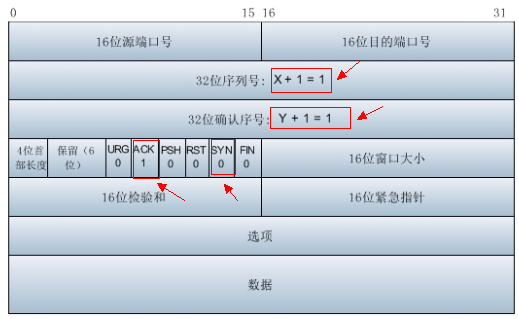

    TCP建立连接，有三次握手行为，三次握手流程图如下所示：
   
   
    下面以访问百度来看一下TCP三次握手行为。如图所示：
   .png)
    
    在上图中我们可以看到TCP建立连接时的三次握手行为，下面我们详细看一下这三次握手行为。
    第一次握手客户端向服务端发送连接请求包，标志位SYN（同步序号）置为1，序号为X=0,如下图所示：
    
   .png)
    
    对应的TCP首部为：
   
   
    第二次握手服务器收到客户端发过来报文，由SYN=1知道客户端要求建立联机。
    向客户端发送一个SYN和ACK都置为1的TCP报文，设置初始序号Y=0，将确认序号（Acknowledgement Number）设置为客户的序列号加1，即X+1 = 0+1 = 1。如图所示：
   .png)
    
    对应的TCP首部为：
   
    
    第三次握手,客户端收到服务器发来的包后检查确认序号（Acknowledgement Number）是否正确，即第一次发送的序号加1（X+1=1）。
    以及标志位ACK是否为1。若正确，ACK标志位为1，SYN标志位为0。确认序号（AcknowledgementNumber）=Y+1=0+1=1，发送序号为X+1=1。
    服务端收到后确认序号值与ACK=1，则连接建立成功，可以传送数据。如图所示：
   .png)
    
    对应的TCP首部为：
   
   
    

   
   
    