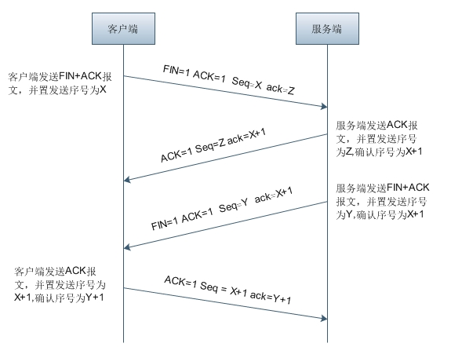
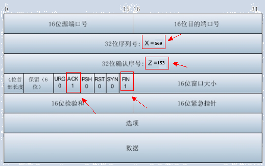
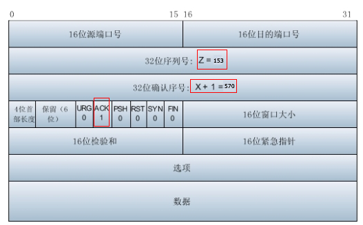
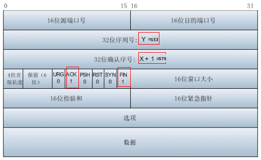
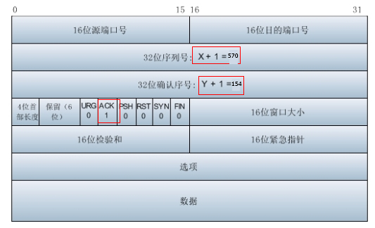

    TCP断开连接时，会有四次断开过程，TCP四次挥手流程图
   
   
    下面我们以访问百度来看一下TCP四次断开连接的行为，下图为用wireshark抓到的TCP四次挥手行为：
   .png)
    
    下面我们详细的看一下这四次挥手行为：
    第一次挥手：客户端给服务器发送TCP包，用来关闭客户端到服务器的数据传送。将标志位FIN和ACK置为1，序号为X=569，确认序号为Z=153。如图所示：
   .png)
    
    对应的TCP首部为：
   
    
    第二次挥手：服务器收到FIN后，发回一个ACK（标志位ACK=1），确认序号为收到的序号加1，即X=X+1=570。序号为收到的确认序号=153
    。如果所示:
   .png)
     
    对应的TCP首部为：
   
    
    第三次挥手为：服务器关闭与客户端的连接，发送一个FIN。标志位FIN和ACK置为1，序号为Y=153，确认序号为X=570。如图所示:
   .png)
   
    对应的TCP首部为：
   
   
    第四次挥手客户端收到服务器发送的FIN之后，发回ACK确认（标志位ACK=1），确认序号为收到的序号加1，即Y+1=154。序号为收到的确认序号X=570。如图所示：
   .png)
    
    对应的TCP首部为：
   
   
    
    