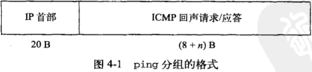
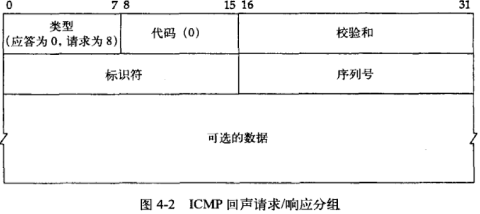
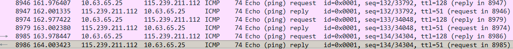
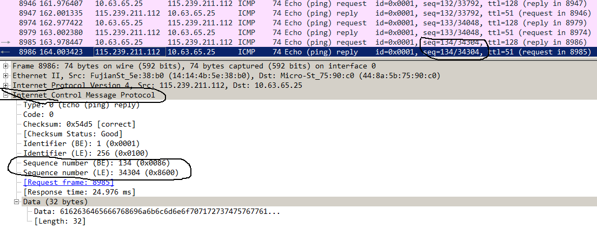

Ping是TCP还是UDP，或者是其他？其报文和过程是怎样的?

    Ping没有使用TCP和UDP，因此是没有端口的.Ping使用的是ICMP的回声(echo)功能来探测对等实体的连通性.ICMP报文是承载在IP数据报文中的，
    但它并不是IP之上的一个独立协议，而是IP协议的一部分。ping的分组格式如下图所示：
   
    
    报文中的ICMP部分，由8字节的首部和n字节的可选数据组成。n的值也就是ping分组中带有的额外数据的字节数通常是56(UNIX)或32(Windows)。
    ICMP回声请求和响应分组的格式如下所示：
    
   
      
     Ping是用标识符(identifier)和序列化(sequence number)来标识返回的ICMP响应，Ping会把自己的进程ID放到identifier字段中，来启到端口号的作用。
     Ping在sequence number字段中放入一个不断增加的计数器，用它来把回声应答与回声请求联系起来，这个数值就是ping结果中显示的icmp_seq。
     下面来看一个用Wireshark来抓取到的一段ping报文：
     
   
   